# BLAST GRID

**A Super-Bomberman-style action game for the [Commander X16](https://www.commanderx16.com/).**

Blow up every enemy, find the exit under the crates and get B.O.B., the Bomb
Operations Bot, through five worlds of a very badly run facility. Or grab
up to three friends (or CPU bots) and blow each other up in battle mode.

BLAST GRID is written for Commander x16: a 65C02 at 8 MHz, the VERA
video chip, YM2151 FM music and VERA PSG sound effects.
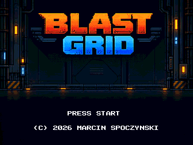

## Screenshots

| | | |
|:-:|:-:|:-:|
| 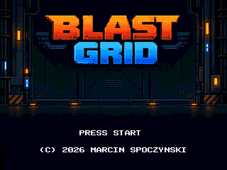 Title | 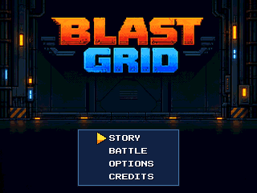 Main menu | 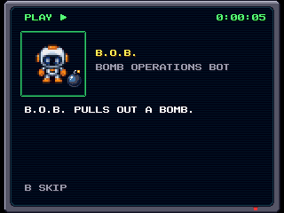 Story: B.O.B. |
| 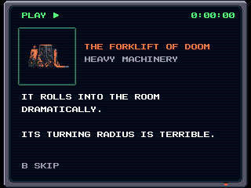 Before the first boss | 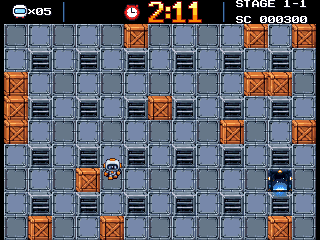 World 1: Factory | 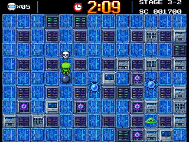 World 3: Data Lab |
| 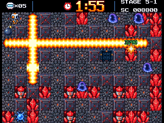 World 5: Deep Core | 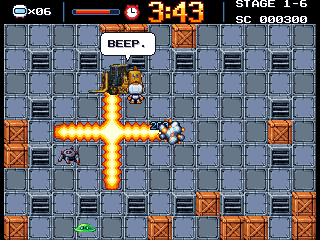 The Forklift of Doom | 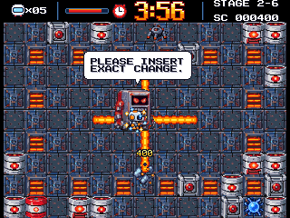 SNACKNET |
| 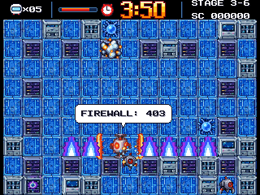 The Firewall | 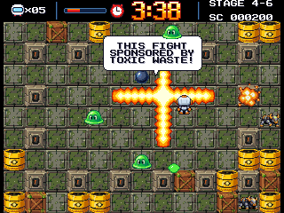 Toxic Influencer | 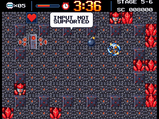 Universal Remote |
| 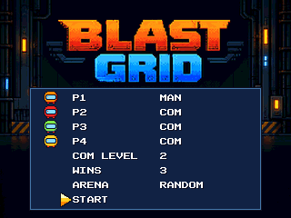 Battle setup | 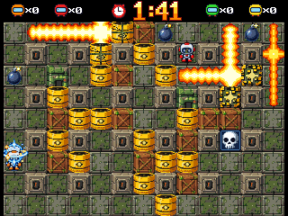 4-player battle | 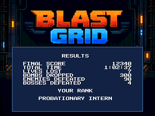 Results and rank |
| 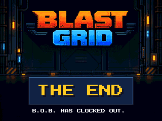 THE END | | |

## Features

- **Story mode:** 5 worlds x 6 stages (Factory, Reactor, Data Lab, Waste
  Processing, Deep Core), each world with its own look, music, enemies and
  power-ups: bomb up, fire up, speed up, kick, remote, wall and bomb pass,
  vest, extra life, and the skull.
- **5 boss fights,** one at the end of every world, with an HP bar, taunts,
  phases and a helper item at half HP.
- **Battle mode:** 2-4 players, any mix of humans and CPU bots (three
  levels), 1-5 wins per match, five arenas or a random one, sudden death.
- **Save and continue:** progress is saved to the SD card at every stage;
  CONTINUE on the main menu picks it up. Results and a rank at the end.
- **Options** (music and effects volume, CPU level) saved to the card.
- An attract-mode demo match plays if the title screen is left alone.
- There are secrets. :D Konami ? 

## Requirements

- A Commander X16 with **512 KB** of banked RAM (or more).
- Tested with **ROM R49** 
- Keyboard, or SNES controllers. Battle players 2-4 need SNES pads in ports
  2-4.

The game writes `BGOPT.BIN` (options) and `BGSAVE.BIN` (the save game) to
the card. Delete them to reset.

## Controls

| | SNES pad (ports 1-4) | Keyboard (player 1) |
|---|---|---|
| Move | D-pad | Cursor keys |
| Drop bomb | B or Y | Z (or Left Alt) / A |
| Action (remote detonate) | A or X | X (or Left Ctrl) / S |
| Pause menu | START | Enter |

The pause menu offers RESUME or QUIT TO MENU. SELECT (Left Shift) while
paused quits at once. In story scenes A turns the page, and B or START skips
the scene. The keyboard always plays as player 1, together with pad 1.

## Building from source

Sources will come soon.

## Licence

[CC BY-NC 4.0](https://creativecommons.org/licenses/by-nc/4.0/) — free to share and adapt
for non-commercial use with credit to Marcin Spoczynski. See [LICENSE](LICENSE).
